## __CONTAINERIZING A SIMPLE WEB APPLICATION USING DOCKER AND HOST IMAGE IN DOCKERHUB__

In this Project we wil be containerizing a simple web application - __MINI FINANCE TEMPLATE__ from [www.tooplate.com](https://www.tooplate.com/). I will be hosting is with on __apache__ service running in an ubuntu container.
This image will be hosted on Dockerhub.

__TASKS:__
 - Install __wget__ and __unzip__.
 - Download the artifact
 - unzip the artifact
 - Archive the artifact in using __tar__
 - Write the Dockerfile
 - Build Docker image
 - Run the container
 - Access the website through the browser
 - Host the Docker image on Dockerhub

install __wget__ and __unzip__

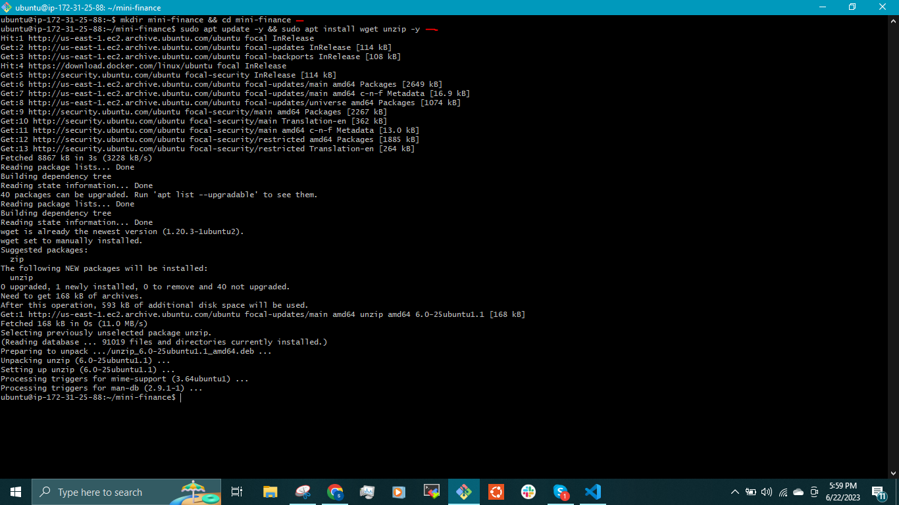

Download and unzip the artifact

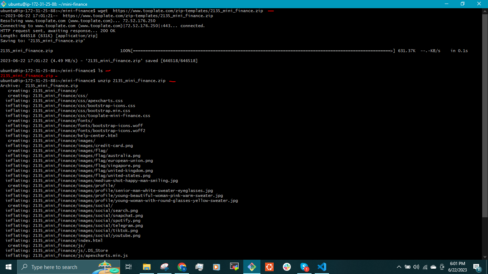

We need to archive the content of the artifact using __tar__  because zip file will not be extracted. 

`$ cd 2135_mini_finance`

`$ tar czvf mini_finance.tar.gz *`

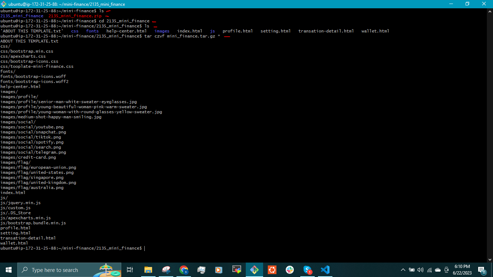
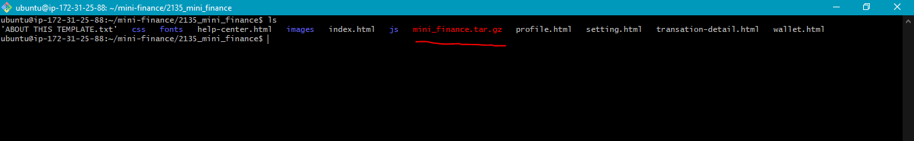

I will move the archived artifact to __/home/ubuntu/mini_finance/__ directory and delete the previous __zip__ file.

`$ mv mini_finance.tar.gz ../`

`$ cd ..`

`$ rm -rf 2135*`

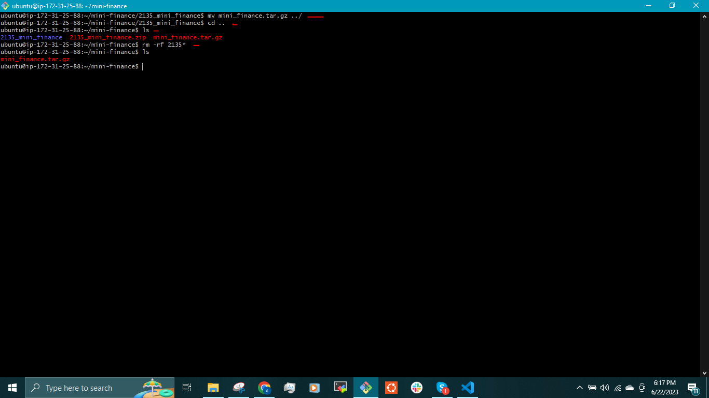

Create a __Dockerfile__ in the same directory as the archived artifact.

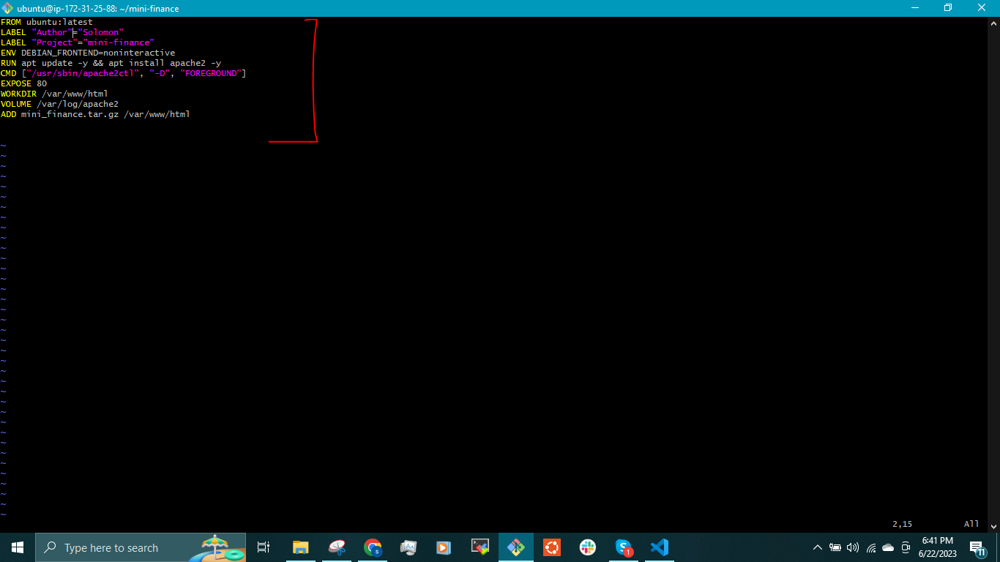

Then we build the image

`$ docker build -t mini_financeimg .`

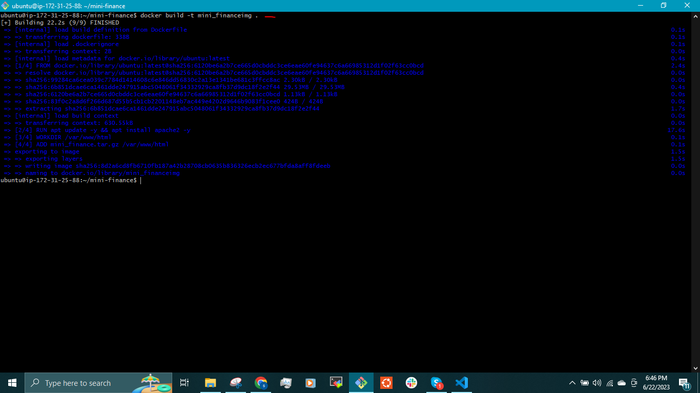

Run the image

`$ docker run -d --name mini-financewebsite -p 9072:80 dybran/mini_financeimg:v2`

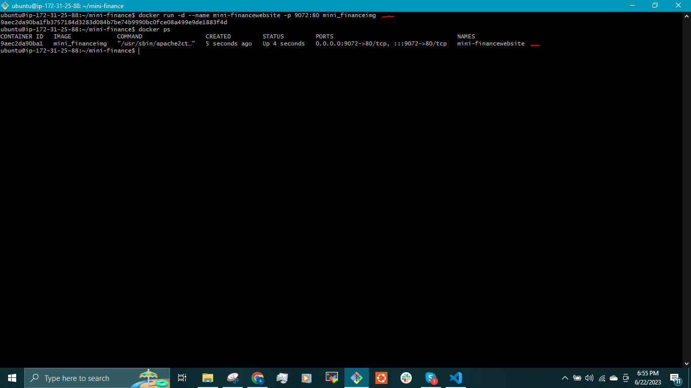

We can access the __MINI FINANCE__ website on the browser

<public-ip-address:9072>

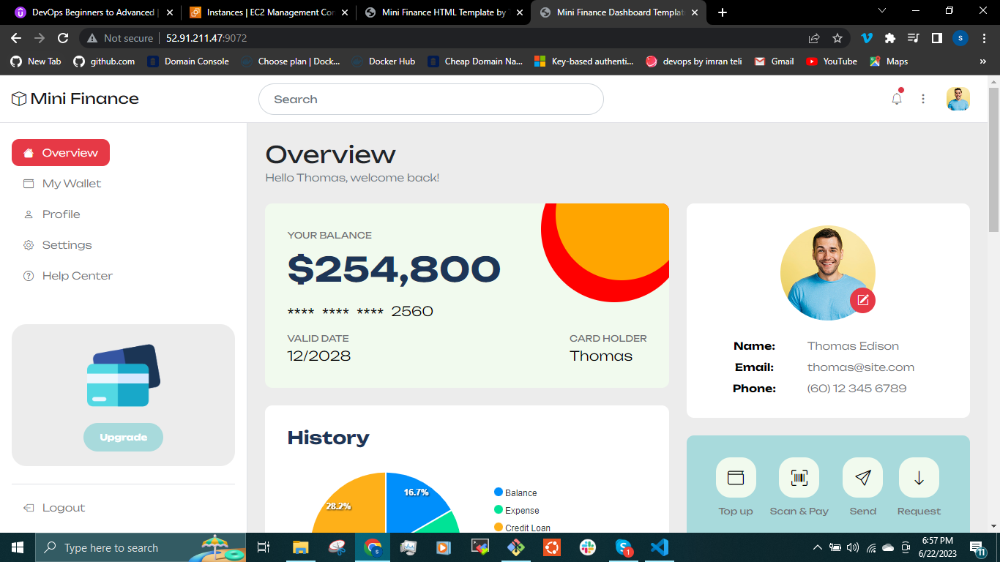

To push the image to dockerhub account, we will have to first tag the image with the dockerhub account name. __i.e  dybran/mini_finance:v2__

`$ docker build -t dybran/mini_financeimg:v2 .`

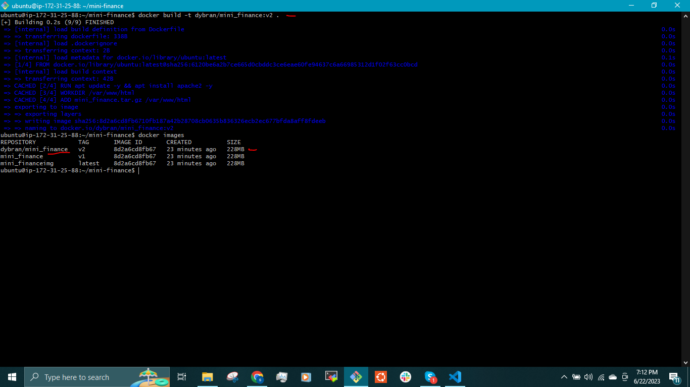

Login to the dockerhub from the docker engine.

`$ docker login` 

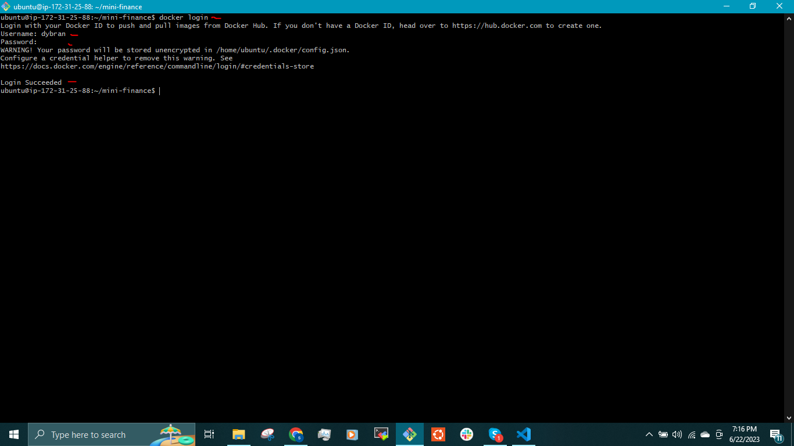

Push the image

`$ docker push dybran/mini_finance:v2`

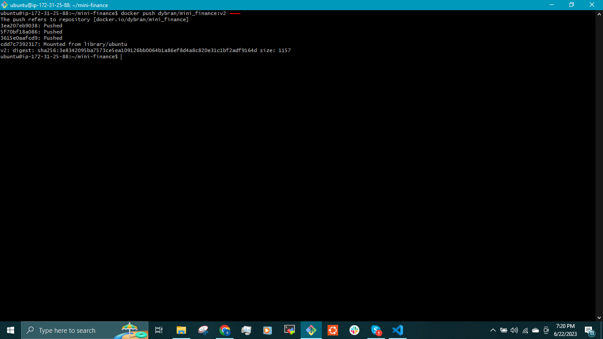

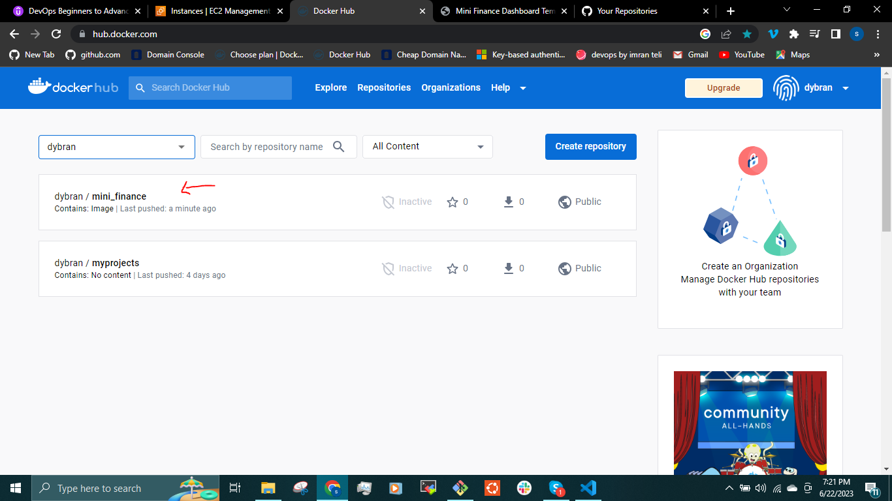

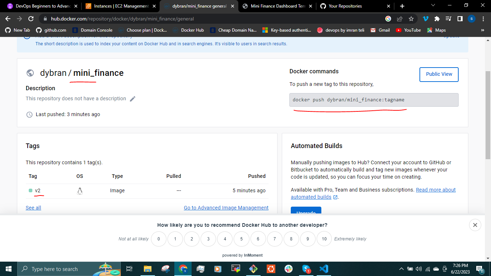

This image can be used by anyone to host the __MINI FINANCE__ website by running the command

`$ docker pull dybran/mini_finance:tagname`

I have successfully containerized a simple website template and hosted the image on dockerhub. I will be __containerizing a Three tier application webstack__ in the [next project](https://github.com/dybran/Containerizing-an-Application-using-Docker).